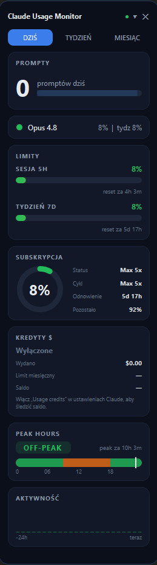

# Claude Usage Monitor

A Windows **system‑tray + always‑on‑top overlay** that shows your Claude
subscription usage in real time — your rolling **5‑hour** and **7‑day** limits,
plan, usage **credits ($)**, peak hours and activity — at a glance.

No API key required: sign in once with your **Claude account (Pro / Max)** and
the app reads your usage straight from the official endpoint.

<p align="center">
  
</p>


> Not affiliated with Anthropic. This is a community tool.

## Features

- 🔐 **Sign in with your Claude account** (OAuth, PKCE) — one click, no API key
- 📊 Live **5h session** and **7d weekly** utilisation with reset countdowns
- 🧮 **Usage credits ($)** card — spent / monthly limit / balance
- 🟢 **Tray icon** that changes colour (green → yellow → orange → red) with usage
- 🪟 **Floating overlay** — frameless, translucent, always‑on‑top, drag anywhere
- 🟣 Subscription gauge, **Peak hours** (US Pacific) and an **Activity** heat‑bar
- 🔔 Threshold notifications at **80 % / 90 % / 100 %** (toast → tray balloon)
- 💾 **SQLite history** with a charts window (daily prompts + 24h trend)
- 🚀 Optional **auto‑start** with Windows
- 🧪 **Demo mode** — the whole UI runs on realistic synthetic data, no account

## How it gets your usage

Pick an auth mode in **Settings → Authorization**:

| Mode | What it does | Needs |
|------|--------------|-------|
| **OAuth (subscription)** ⭐ | Calls `GET /api/oauth/usage` with your Claude token for real 5h/7d utilisation and credits | a Claude Pro/Max account |
| **API key** | Pings `/v1/messages` (`max_tokens=1`) and reads the `anthropic-ratelimit-*` headers | an `sk-ant-…` key |
| **Demo** | Synthetic data, no network | nothing |

**OAuth is the default and recommended mode** for subscribers — it shows the same
limits you see in the Claude app and costs nothing.

## Quick start

```powershell
git clone <your-fork-url> claude-usage-monitor
cd claude-usage-monitor

python -m venv .venv
.\.venv\Scripts\Activate.ps1
pip install -r requirements.txt

python -m src.main
```

The widget appears top‑right and a circular icon appears in your tray.
**Left‑click** the tray icon to show/hide the widget, **right‑click** for the menu.

## Signing in

Open **Settings** (right‑click tray → *Ustawienia…*) → **Authorization**:

1. Make sure **Type** is set to **OAuth — subskrypcja**.
2. Click **“Zaloguj się przez Claude”** (*Sign in with Claude*).
3. Your browser opens Claude’s consent page → click **Authorize**.
4. Copy the authorization code shown and paste it back into the app → **Zaloguj**.

That’s it — the widget switches to live data immediately.

If you already use **Claude Code** or the **Claude desktop app** on the same
Windows account, the monitor will **auto‑detect** that login and you can skip the
button entirely (the status line shows e.g. *“✓ Wykryto (Max 5x)”*).

## Privacy & security

This tool is built to be safe to publish and safe to run:

- **No credentials are bundled.** Nothing personal is hard‑coded anywhere in the
  source. Your token is obtained at runtime, by *you*, through the official
  Claude OAuth flow.
- **Tokens stay on your machine.** A token obtained via the in‑app login is
  cached only in `%APPDATA%\ClaudeMonitor\oauth_cache.json`. The app never sends
  it anywhere except Anthropic’s own API (`api.anthropic.com`,
  `console.anthropic.com`).
- **Auto‑detected tokens are read‑only.** When reading an existing Claude login,
  the app never modifies or rotates the source app’s tokens.
- **API keys** (if you use that mode) are stored in the **Windows Credential
  Manager**, not in plain text.
- Runtime data (DB, logs, config, token cache) lives in `%APPDATA%\ClaudeMonitor\`
  and is git‑ignored.

> A note for contributors: `.credentials.json`, `oauth_cache.json`, `*.db` and
> `*.log` are in `.gitignore` — please keep it that way and never commit a real
> token.

## Controls

- **Drag** the widget anywhere to reposition (position is remembered)
- Header **▾ / ▴** toggles compact / full layout
- Header **✕** hides the widget (the app keeps running in the tray)
- Tabs **DZIŚ / TYDZIEŃ / MIESIĄC** switch the prompt counter period (today / week / month)

## Building a standalone .exe

```powershell
pip install pyinstaller
python build.py            # one‑file windowed build in .\dist
python build.py --onedir   # faster‑starting folder build
```

## Project layout

```
src/
  main.py            app wiring & lifecycle
  config.py          layered config (TOML defaults + JSON user overrides)
  constants.py       paths, models, thresholds, endpoints
  api/
    client.py        usage/ratelimit fetching + mock generator
    oauth.py         token discovery, decryption, refresh
    oauth_login.py   interactive OAuth (PKCE) login flow
    usage.py         /api/oauth/usage JSON → UsageSnapshot
    headers.py, models.py, poller.py
  ui/                overlay, tray, settings, login dialog, history + components
  storage/           SQLite database + history queries
  utils/             notifications, autostart, keyring, peak hours
config/default.toml  shipped defaults
assets/              icon generator + screenshot
```

## Requirements

- Windows 10 / 11, Python 3.10+
- See [`requirements.txt`](requirements.txt). Optional extras degrade gracefully:
  - `cryptography` — only needed to auto‑detect the **Claude desktop app’s**
    encrypted token; the in‑app login and the CLI’s plaintext token work without it.
  - `win10toast` — richer toasts; falls back to tray balloons.

## Troubleshooting

- **“Invalid request format” after Authorize** — make sure you’re on the latest
  version; the login flow requires `state == code_verifier` (fixed in this repo).
- **Widget shows demo data** — no usable token was found. Use *Sign in with
  Claude*, or sign in via Claude Code / the desktop app on the same user.
- **Credits show “Wyłączone / —”** — the usage endpoint only returns a balance
  while *Usage credits* is **enabled** in your Claude billing settings; otherwise
  the values are `null`. This is an API limitation, not a bug.
- **No tray icon** — re‑enable “Show all icons” in taskbar settings; the overlay
  still runs.
- **`ModuleNotFoundError: PyQt6`** — activate your venv and re‑run
  `pip install -r requirements.txt`.
- **Peak hours look off** — ensure `tzdata` is installed (it’s in requirements).

## Contributing

Issues and PRs welcome. The UI strings are currently in **Polish**; an English
localisation is a great first contribution — UI text lives in `src/ui/`. Please
keep secrets out of commits (see *Privacy & security*).

## License

[MIT](LICENSE). Provided as‑is, with no warranty. Not affiliated with Anthropic;
“Claude” is a trademark of Anthropic, PBC.
